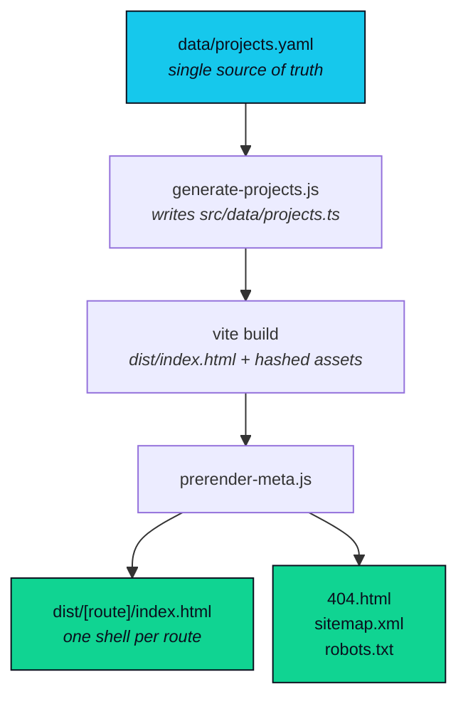
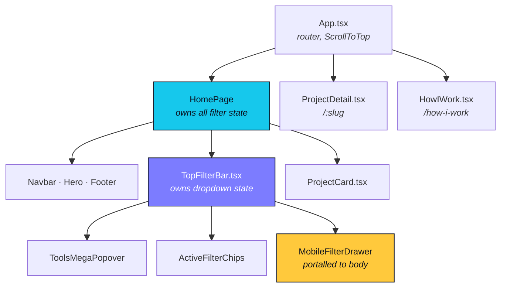
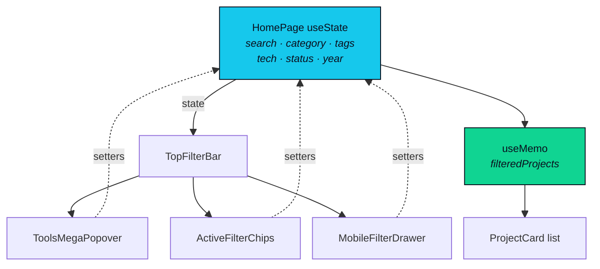
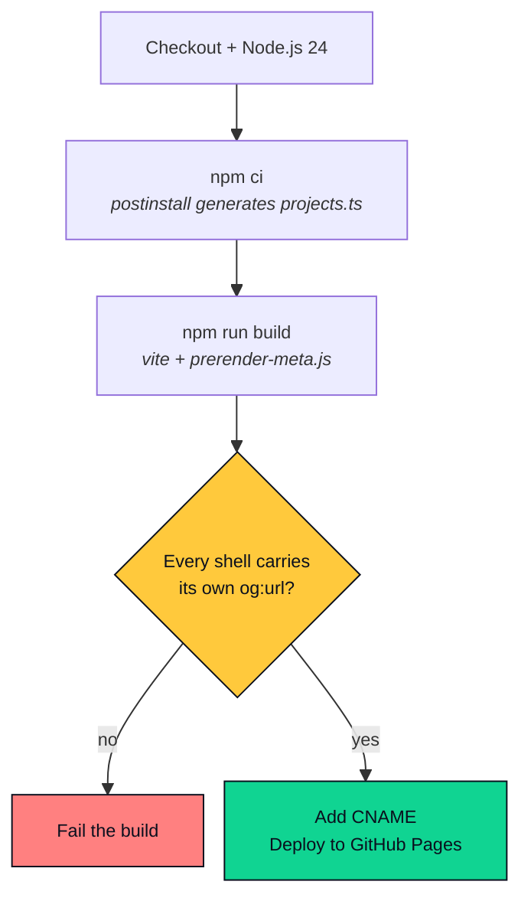

# projects.ibtisam-iq.com

> DevOps projects portfolio. Kubernetes deployments, AWS infrastructure, CI/CD pipelines, and GitOps workflows. Built from scratch with source code and runbooks.

[](https://github.com/ibtisam-iq/projects/actions/workflows/pages.yml)
[](https://projects.ibtisam-iq.com)
[](https://react.dev)
[](https://www.typescriptlang.org)
[](https://tailwindcss.com)
[](https://vite.dev)

**[Overview](#overview)** · **[Data Pipeline](#data-pipeline)** · **[Features](#features)** · **[Adding a Project](#adding-a-project)** · **[Architecture](#component-architecture)** · **[Structure](#project-structure)** · **[Development](#local-development)** · **[CI/CD](#cicd-pipeline)**

---

## Overview

Source for [projects.ibtisam-iq.com](https://projects.ibtisam-iq.com): a filterable, searchable DevOps projects showcase.

Two properties define the design:

- **Data-driven.** All project content lives in [`data/projects.yaml`](./data/projects.yaml). Adding a project needs no source code change.
- **Prerendered for crawlers.** The site is a client-rendered SPA, so every route would otherwise serve identical metadata. A post-build step writes one HTML shell per route.

---

## Data Pipeline

One YAML file drives the build. Nothing downstream is edited by hand.



| Stage | Runs | Produces |
|---|---|---|
| `generate-projects.js` | `postinstall`, `dev`, `build` | `src/data/projects.ts` and the `getAll*` facet helpers |
| `vite build` | `build` | Hashed JS and CSS bundles, one shared `index.html` |
| `prerender-meta.js` | after `build` | Per-route shells, `404.html`, `sitemap.xml`, `robots.txt` |

> [!NOTE]
> `src/data/projects.ts` is generated and gitignored. It is recreated by `postinstall`, `npm run dev`, and `npm run build`. Run `npm run generate` to refresh it without starting a server.

---

## Features

**Filtering**

- **Search** across title, short description, and technology names.
- **Category**: Platform or Tool, with live counts.
- **Skills**: multi-select capability tags such as `ci-cd`, `gitops`, `kubernetes`.
- **Technologies**: multi-select, grouped into four domains with in-popover search.
- **Status** and **Year**: both derived from the data at build time.

> [!NOTE]
> Filter options come from `getAllStatuses()` and `getAllYears()`, never a hardcoded list. An option that matches zero projects cannot appear, and the Year control stays hidden while every project shares one year.

**Pages**

- **Detail pages** rendering dynamic sections, skills, tech stack, and link buttons.
- **Methodology page** at `/how-i-work` outlining the engineering pipeline.

**Interface**

- Dark theme locked to a deep space `#070b14` gradient with frosted glass panels.
- Count-up hero stats via `requestAnimationFrame` with an easeOut curve.
- Scroll reveals through `IntersectionObserver` with staggered delays.
- Scroll progress indicator anchored to the top of the viewport.
- Below the `lg` breakpoint, filters collapse into a full-screen drawer with a focus trap and background scroll lock.
- Every animation respects `prefers-reduced-motion`.

---

## Adding a Project

> [!NOTE]
> No source code changes are required to add a project.

1. Append an entry to [`data/projects.yaml`](./data/projects.yaml).
2. Push to `main`.
3. The pipeline compiles, prerenders, and deploys in roughly two minutes.

**Optional `metaTitle`**, roughly 45 to 55 characters:

- Used for the page `<title>` and `og:title`.
- Full `title` values run past what search results and link previews display.
- When omitted, the build falls back to `title` up to the first `:` or `,`.
- The meta description falls back to the first sentence of `shortDescription`.

The same rule is mirrored client-side in [`src/utils/pageTitle.ts`](./src/utils/pageTitle.ts), so the prerendered shell and the hydrated app never disagree on a title.

**References**

- [Project Card Authoring Standards](https://blog.ibtisam-iq.com/project-card-authoring-standards/): authoring guide and writing standards.
- [Architecture & Schema Reference](./docs/architecture.md#project-schema): data pipeline and schema specification.

---

## Component Architecture



> [!IMPORTANT]
> `MobileFilterDrawer` renders through `createPortal` into `document.body`. `TopFilterBar` is `relative z-30`, which creates a stacking context, so a `fixed` child inside it cannot rise above the `z-50` sticky navbar no matter how high its own z-index goes.

### Filter state flow

State lives in one place. Every control reads and writes the same values, so desktop and mobile cannot drift.



Facet counts beside every option come from `calculateProjectCounts()` in [`src/utils/toolCategories.ts`](./src/utils/toolCategories.ts), computed once per project list.

---

## Tech Stack

| Layer | Technology |
|---|---|
| Framework | **React 19** + **TypeScript 5.9** |
| Styling | **Tailwind CSS v4**, `@import` plus an `@config` bridge to `tailwind.config.js` |
| Build tool | **Vite 8** |
| Routing | **React Router v7** |
| Icons | **React Icons** |
| Fonts | **Plus Jakarta Sans**, **JetBrains Mono**, **Inter** (Google Fonts) |
| Data format | YAML to TypeScript, generated at build time |
| Hosting | **GitHub Pages** |
| CI/CD | **GitHub Actions** |
| Custom domain | `projects.ibtisam-iq.com` |

> [!NOTE]
> The theme is locked to dark: `<html class="dark">` in `index.html` plus `color-scheme: dark` in `index.css`. There is no theme provider or toggle. `darkMode: 'class'` remains in the config so existing `dark:` variants keep resolving.

---

## Project Structure

```text
projects/
├── archive/
│   ├── README.md               # Why files are archived, naming rule, restore notes.
│   └── workflows/              # Superseded workflows. Nothing here runs.
├── data/
│   └── projects.yaml           # Single source of truth. Edited to add or update projects.
├── docs/
│   └── architecture.md         # Full architecture and pipeline documentation.
├── scripts/
│   ├── generate-projects.js    # Converts projects.yaml to src/data/projects.ts.
│   └── prerender-meta.js       # Per-route shells, 404.html, sitemap.xml, robots.txt.
├── src/
│   ├── components/
│   │   ├── Navbar.tsx          # Sticky nav: scroll-progress bar, repository link, mobile menu.
│   │   ├── Hero.tsx            # Landing section with animated stat counters.
│   │   ├── TopFilterBar.tsx    # Owns dropdown state; desktop filter deck + mobile trigger.
│   │   ├── ToolsMegaPopover.tsx   # 4-column tech selector with in-popover search.
│   │   ├── ActiveFilterChips.tsx  # Match count, removable chips, quick presets, reset-all.
│   │   ├── MobileFilterDrawer.tsx # Full-screen drawer below `lg`, portalled to <body>.
│   │   ├── ProjectCard.tsx     # Card with scroll reveal and hover glow.
│   │   ├── ProjectDetail.tsx   # Project page with dynamic sections and sidebar metadata.
│   │   ├── HowIWork.tsx        # /how-i-work methodology page.
│   │   └── Footer.tsx
│   ├── hooks/
│   │   ├── useCanonical.ts     # Keeps <link rel="canonical"> in sync on route change.
│   │   ├── useCountUp.ts       # requestAnimationFrame counter with easeOut curve.
│   │   └── useInView.ts        # IntersectionObserver hook for scroll-triggered animations.
│   ├── utils/
│   │   ├── pageTitle.ts        # Client mirror of the prerender title rule.
│   │   └── toolCategories.ts   # Buckets tech into 4 domains; computes facet counts.
│   ├── data/
│   │   └── projects.ts         # AUTO-GENERATED. Gitignored. Never edited by hand.
│   ├── types/
│   │   └── project.ts          # Project TypeScript interface.
│   ├── App.tsx                 # Router setup, ScrollToTop wrapper.
│   ├── main.tsx
│   └── index.css               # Gradient background, scrollbars, animations, skip-link.
├── .github/
│   └── workflows/
│       └── pages.yml           # CI/CD pipeline.
├── public/                     # Favicon, icons, web manifest.
├── CNAME
├── index.html
├── package.json
├── tailwind.config.js          # Color tokens, fonts, animations.
├── vite.config.ts
└── tsconfig.app.json
```

---

## Local Development

```bash
git clone https://github.com/ibtisam-iq/projects.git
cd projects
npm install     # postinstall generates src/data/projects.ts
npm run dev
```

| Command | Purpose |
|---|---|
| `npm run dev` | Generate data, then start Vite |
| `npm run build` | Generate, typecheck, bundle, prerender |
| `npm run generate` | Refresh `src/data/projects.ts` only |
| `npm run lint` | ESLint across the repo |

### Local CI testing with `act`

```bash
act push -W .github/workflows/pages.yml
```

> [!NOTE]
> Artifact upload and Pages deployment are skipped via `if: ${{ env.ACT != 'true' }}` guards. The `act` utility sets that variable automatically.

---

## CI/CD Pipeline

| Trigger | Behaviour |
|---|---|
| `push` to `main` | Build and deploy |
| `pull_request` to `main` | Build only. Deploy job skipped via `if: github.event_name != 'pull_request'` |
| `workflow_dispatch` | Manual re-run from the Actions UI |



### Why the SEO files are generated, not static

`sitemap.xml`, `robots.txt`, and `404.html` are written by `prerender-meta.js` rather than held in `public/`:

- The SPA fallback would answer `/robots.txt` and `/sitemap.xml` with the app shell, so a crawler asking for the sitemap would receive HTML.
- The sitemap is built from the same route list as the shells, so a project cannot appear in one without appearing in the other.
- `404.html` carries its own title, a self-referential canonical, and `noindex`. A copy of `index.html` would give every dead URL the home page metadata instead.

The `og:url` check is a build gate, not a warning. A shell left pointing at the site root means the metadata swap silently failed, which is exactly the case crawlers would expose in production.

---

## Architecture

For the data pipeline, design constraints, and extension points, see [`docs/architecture.md`](./docs/architecture.md).

---

<div align="center">

**Muhammad Ibtisam Iqbal**

DevOps & Cloud Engineer · Kubernetes · AWS · CI/CD

[Website](https://ibtisam-iq.com) · [LinkedIn](https://linkedin.com/in/ibtisam-iq)

</div>